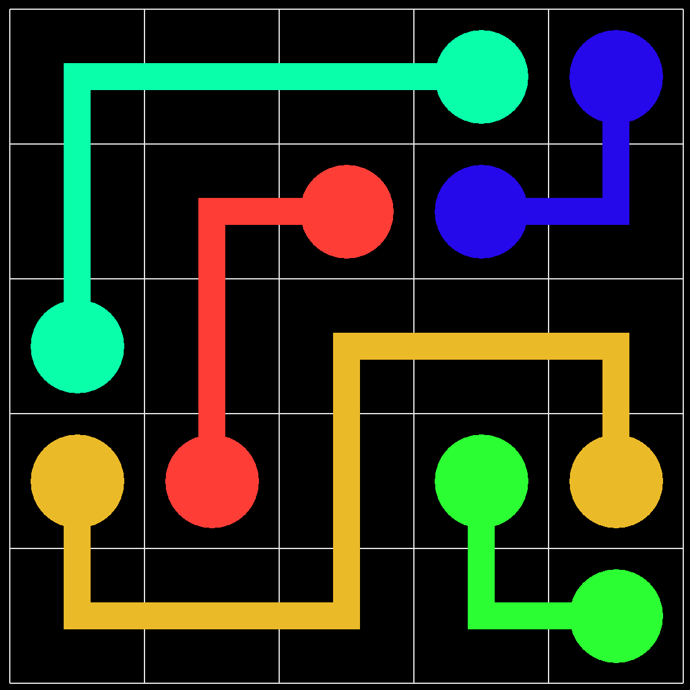

# Flow Free AI

An AI-based solver for the popular mobile game [Flow Free](https://play.google.com/store/apps/details?id=com.bigduckgames.flow)

This project is a <span style="color:darkred">**work in progress**</span>, and is expected to break (or at least be inefficient) in many cases.



## Usage

```python
python solver.py
```

## Contributing
Pull requests are welcome. For major changes, please open an issue first to discuss what you would like to change.

Please make sure to update tests as appropriate.

## License
[MIT](https://choosealicense.com/licenses/mit/)